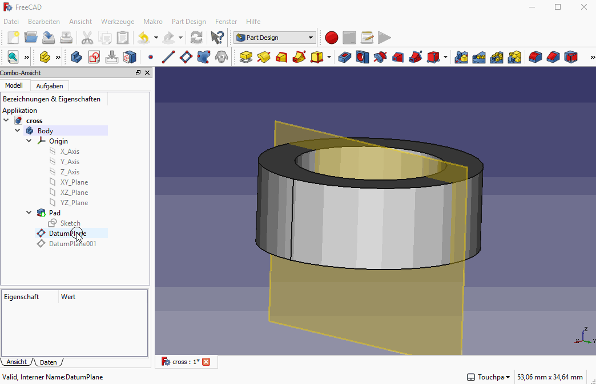

# clip-sketch

This macro creates a temporary cross section at the sketch plane in order to 'look into' a object when you want to create a feature on the inside of an object (i.e. create a revolved groove on the inner side of a tube). 

The macro creates a clipping plane at the sketch plane and activates it. Running the macro again deletes the clipping plane. 

If you map the macro to F7 it behaves almost exactly like in Autodesk Inventor, from which I got the inspiration.

